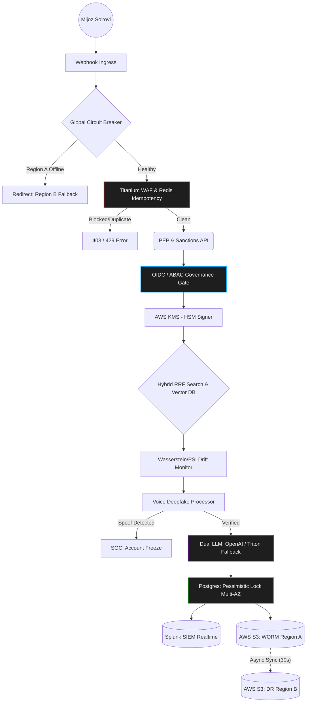

<div align="center">

# 🏦 REVENANT
## _Bank AI Avtomatlashtirish Platformasi — Milliy Darajadagi Xavfsizlik_

> **"Hech qanday inson agenti kerak emas. Faqat natija."**

[-blueviolet?style=for-the-badge&logo=github)](https://github.com/)
[](https://github.com/)
[](https://github.com/)
[](https://github.com/)
[](https://github.com/)
[](https://github.com/)
[](https://github.com/)
[](https://github.com/)

---

**🏆 PDP EcoSystem Startup Competition 2025** **Kategoriya: Sanoat va tadbirkorlikda sun'iy intellekt texnologiyalari**

</div>

---

## 💡 Oddiy Insonlar va Investorlar Uchun (Executive Summary)

**Revenant o'zi nima?** Tasavvur qiling, bankning call-markazida ishlaydigan minglab operatorlar o'rnini bitta "Super-Xodim" (Sun'iy Intellekt) egalladi. Ammo u oddiy chatbot emas:
* **U uxlamaydi va charchamaydi:** Bir vaqtning o'zida 5000 ta mijozga xizmat ko'rsata oladi.
* **U aldanmaydi:** Agar mijozning ovozi sun'iy intellekt orqali soxtalashtirilgan (Deepfake) bo'lsa, tizim buni sezadi va jinoyatchi pulni yechib ketmasidan oldin hisobni bloklaydi.
* **U xato qilmaydi:** Agar serverlar joylashgan bino yonib ketsa ham, u o'z ma'lumotlarini 1 soniya ichida boshqa shahardagi zaxira serverga uzatib, tranzaksiyalarni yo'qotmasdan ishlashda davom etadi.
* **Avtomatik tranzaksiyalarni ovoz yoki text orqali almalga oshiradi**
* **Ivoys (INN) , Kommunal xizatlar ,xullas barcha to'lov amallarini bajarishda foydalanuvchini yo'naltiradi**
> *"O'zbekiston banklari har kuni minglab mijoz murojaatini qo'lda ko'rib chiqmoqda. Har bitta tiket agentdan o'rtacha **15 daqiqa** va **12,500 UZS** sarflaydi. REVENANT bu muammoni hal qiladi: har bir tiketni **2,500 UZS**ga, **soniyalar ichida**, qat'iy xavfsizlik arxitekturasi bilan avtomatik ishlaydi. Bu faqat chatbot emas — bu O'zbekistondagi birinchi **Tier-1 darajadagi, harbiy sinfli** bank AI orkestrasiya platformasidir."*

### 🎯 Biznes Muammo va REVENANT Yechimi

| # | Muammo | Joriy Holat | REVENANT Yechimi |
|---|--------|-------------|------------------|
| 1 | **Agent samaradorligi** | Har bir tiketga 15 min + 12,500 UZS | AI 2,500 UZS'ga soniyada hal qiladi |
| 2 | **SLA nazorati** | Manual kuzatuv, kechikishlar | Avtomatik kritik/yuqori/o'rta/past darajali SLA |
| 3 | **Xavfsizlik** | Statik himoya, hakerlik hujumlariga zaif | WAF + Vault + AWS KMS + PII to'siq |

---

## 💰 MOLIYAVIY ROI VA BIZNES MODELI

> *Barcha ko'rsatkichlar HashiCorp Vault KV v2 dan dinamik yuklanadigan `Configuration Loader` orqali hisoblanadi.*

### 📈 ROI Kalkulyatsiyasi

| Ko'rsatkich | Formulа | Natija |
|------------|---------|--------|
| **Tiket boshiga tejash** | `12,500 − 2,500` | **10,000 UZS** |
| **Oylik tejash (10k tiket)** | `10,000 × 10,000` | **100,000,000 UZS** |
| **Yillik tejash** | `100,000,000 × 12` | **1,200,000,000 UZS** |
| **ROI foizi** | `(12,500 − 2,500) / 2,500 × 100` | **400%** |
| **Vaqt tejamkorligi** | `15 daqiqa/tiket × 10,000` | **2,500 soat/oy** |

### 💳 Moliyaviy Xavfsizlik Chegaralari
* **`HARD_CEILING_USD = $50,000`** → Tranzaksiya darhol rad etiladi (Iron Hand Policy).
* **`CHALLENGE_FLOOR = $10,000`** → Biometrik ovoz liveness (jonlilik) tekshiruvi majburiy.

---

## 🏗️ TIZIM ARXITEKTURASI: V30 GLOBAL SCALE

### 1. Makro Daraja: Global Mantiq Oqimi (Macro Flow)
Nol-ishonch (Zero-Trust) va ofatlarga chidamlilik (Multi-AZ) asosida qurilgan V30 arxitekturasi:



### 2. Mikro Daraja: To'liq Tugunlar Oqimi (Micro Flow)

Tizim ichki qatlamlarda 130 dan ortiq izolyatsiya qilingan bloklar orqali ishlaydi:

```mermaid
flowchart TD
    subgraph INGRESS ["🌐 INGRESS LAYER"]
        WH["📡 Webhook Ingestion"]
        VP["🎙️ Voice Processor\n(Biometric Controller v30)"]
    end

    subgraph WAF_NORM ["🛡️ BLOCK 1: WAF & NORMALIZATION"]
        NORM["⚡ PROD Input Normalizer\n[Redis Rate Limit: 10/min]"]
        TIT["🛡️ Titanium Sanitizer\n[SQLi | XSS | CEO Fraud]"]
    end

    subgraph VAULT_ZONE ["🔐 ZERO-TRUST CONFIG ZONE"]
        VAL["🔑 Vault: AppRole Login"]
        CL["⚙️ Configuration Loader\n[Dynamic Configs]"]
    end

    subgraph CLASSIFICATION ["🤖 BLOCK 2: CLASSIFICATION"]
        LDE["🌐 Language Detection\n[Alignment Tables]"]
        MR["🧭 Master Router\n[Risk Scoring]"]
    end

    subgraph AI_BLOCK ["🧠 BLOCK 4: AI CONSENSUS"]
        LLM1["🤖 LLM OpenRouter (OpenAI)"]
        LLM2["🤖 LLM OpenRouter (Anthropic)"]
        CEV["⚖️ Consensus Engine Validator"]
    end

    subgraph APPROVAL ["✍️ BLOCK 5: APPROVAL & DISPATCH"]
        SDL["🔒 Postgres: Acquire Lock\n(Multi-AZ)"]
        UAS["📝 Postgres: Update State\n(Multi-AZ)"]
    end

    subgraph MEMORY ["🧠 BLOCK 6: MEMORY CORE"]
        SRPC["🔍 Supabase Hybrid RRF Search"]
        MIG["🛡️ Memory Integrity Guard\n[Wasserstein/PSI Drift]"]
    end

    subgraph AUDIT ["🔏 BLOCK 7: FORENSIC AUDIT"]
        B74["🕵️ PII Forensic Scrubber"]
        B76["🔑 AWS KMS HSM Signer"]
        B77["📡 Telemetry Sink (Splunk/S3)"]
    end

    WH --> VP --> NORM --> TIT --> VAL --> CL --> LDE --> MR --> LLM1 --> LLM2 --> CEV --> SDL --> UAS --> SRPC --> MIG --> B74 --> B76 --> B77

```



---

## ⚙️ 5 BOSQICHLI TEXNIK EVOLYUTSIYA (V30 TAHLILI)

Loyiha eng so'nggi xavfsizlik standartlari (ISO/IEC 27001) asosida n8n, HashiCorp Vault, PostgreSQL va Redis ekotizimida 5 bosqichda ishlab chiqildi:

### 🛡️ Phase 1: Ingress Perimeter va Kiber-Mudofaa

* **Redis Idempotency:** Har bir so'rovga `UUIDv4` kaliti beriladi. Tarmoqdagi xatolik sabab so'rov takrorlansa, Redis `SET NX` orqali uni darhol kesib tashlaydi (Double-spending oldi olinadi).
* **Titanium WAF V30:** SQL inyeksiyalar (`UNION SELECT`), chuqur XSS hujumlar hamda CEO-impersonation kabi ijtimoiy muhandislik xujumlarini zararsizlantiradi.
* **PEP/Sanctions Hook:** Ma'lumot AI ga yetib borguniga qadar, mijoz xalqaro qidiruv yoki sanksiyalar ro'yxatida (Sanctions API) bor-yo'qligini tekshiradi.

### 🔐 Phase 2: Tranzaksiyalar Izolyatsiyasi (Core Banking)

* **Pessimistic Locking:** Bank ma'lumotlar bazasida (PostgreSQL) `SELECT ... FOR UPDATE` SQL skripti yordamida qulflash tizimi yaratildi. Bu "Race Condition" xatoligini nolga tushiradi.
* **AWS KMS HSM & WORM Storage:** Moliyaviy loglar xotirada emas, balki Amazon AWS KMS (Hardware Security Module) da FIPS 140-2 darajasida imzolanadi. Yozuvlar AWS S3 Glacier (WORM) tizimiga yoziladi — ularni 5 yilgacha hech kim o'chira olmaydi.

### 🧠 Phase 3: Gibrid Qidiruv (RRF) va AI Mustaqilligi

* **Reciprocal Rank Fusion (RRF):** Tizim mijoz so'rovini qidirishda faqatgina Vektor izlash (Dense) emas, balki aniq kalit so'zlar (BM25 Sparse) algoritmlarini birlashtiradi.
* **AI Circuit Breaker:** Agar OpenAI/Anthropic serverlari 2 soniyadan ortiq qotib qolsa, tizim avtomatik ravishda bankning o'z ichki serverlarida ishlaydigan lokal **Triton Inference Serveriga** failover qiladi.

### 🔬 Phase 4: Matematik Drift va Deepfake Nazorati

* **Wasserstein Distance va PSI:** AI xotirasi doimiy matematik tahlil qilinadi. Xakerlar sun'iy intellektni chalg'itishga (Prompt Poisoning) urinsa, og'ish (Drift) buni sezadi va karantin e'lon qiladi.
* **Deepfake SOC Escalation:** Ovozli so'rovda sintetik belgilar (Deepfake) yoki yozib olingan audio (Replay Attack) aniqlansa, tizim kiber-xavfsizlik markaziga (SOC) hisobni global muzlatish (`GLOBAL_ACCOUNT_FREEZE`) buyrug'ini yuboradi.

### 🌍 Phase 5: Global Masshtab va O'lmaslik (Chaos Engineering)

* **Multi-AZ Failover:** PostgreSQL bazamiz Primary/Standby rejimida ishlaydi. `Retry` mexanizmlari server o'chib qolsa ham tranzaksiyalar uzilmasligini ta'minlaydi.
* **Chaos Engineering:** Tashqi `Grafana k6` Cloud orqali har tunda tizimga 5000 TPS yuklama beruvchi maxsus Cron Workflow ishlab chiqilgan.
* **Cross-Region Sync:** Asosiy viloyatdagi WORM loglar har 30 soniyada S3 zaxira xotirasiga (Region B) asinxron replikatsiya qilinadi.

---

## 📋 NOD-BA-NOD CHUQUR TAHLIL (EXHAUSTIVE DEEP DIVE)

Revenant platformasi yuqoridagi 5 fazani 10 ta mantiqiy bloklarga ajratilgan holda n8n da amalga oshiradi.

### 🌐 BLOK 0: Ingress va Xavfsizlik Qatlami

* **`Webhook Ingestion` & `Global Circuit Breaker`:** Barcha so'rovlar qabul qilinadi. Agar joriy mintaqa (Region A) yiqilgan bo'lsa, HTTP 307 orqali zudlik bilan Region B ga yo'naltiriladi.
* **`Voice Processor`:** Biometrik tekshiruv. 60 soniyalik anti-replay oyna. `NEON-XXXX` formatida Liveness (jonlilik) chaqiruvi tekshiriladi. Constant-Time solishtirish orqali Timing-Attack larning oldi olinadi.
* **`Titanium Sanitizer`:** Barcha payloadlar `sanitizeString()` funksiyasidan o'tadi. Ufer overflow, XSS (`<script>`), SQLi (`1=1, drop table`) to'liq tozalanadi.

### 🔐 BLOK 1: Zero-Trust Konfiguratsiya (Vault)

* **`Vault: AppRole Login`:** HashiCorp Vault serveriga ulanib, qisqa muddatli `client_token` oladi. API kalitlar kod ichida saqlanmaydi.
* **`Configuration Loader`:** Vaultdan `AGENT_HOURLY_RATE`, `HMAC_SECRET`, `UZS_EXCHANGE_RATE` kabi moliyaviy sirlarni tortib oladi va workflow global kontekstiga joylaydi.

### 🤖 BLOK 2: Klassifikatsiya va Niyatni Aniqlash

* **`Language Detection Engine`:** O'zbek, Rus va Ingliz tillarini aniqlovchi qat'iy ball tizimi. V30 versiyada tillar `urn:revenant:alignment:...` formatidagi inson tomonidan tasdiqlangan tarjima stollariga (Alignment Tables) bog'lanadi.
* **`Master Router` & `Rule-Based Severity Classifier`:** Tranzaksiya summasi (40%), masofa (25%), tezlik (20%) kabi ko'rsatkichlarga qarab niyat (Intent) riskini baholaydi.

### 🧠 BLOK 4: Dual-LLM Konsensus Mexanizmi

REVENANT'ning eng innovatsion yechimlaridan biri.

1. `Prep Consensus Payload` so'rovni tayyorlaydi.
2. `LLM OpenRouter (OpenAI - gpt-4o-mini)` va `LLM OpenRouter (Anthropic - Claude)` bir vaqtda so'rovni qayta ishlaydi.
3. **`Consensus Engine Validator`** ikkala LLM javobini solishtiradi. Agar ular kelishmasa yoki ishonch (confidence) 0.7 dan past bo'lsa, tizim "Gallyutsinatsiya" riskini inobatga olib deterministik fallback rejimiga o'tadi.

### ✍️ BLOK 5: Tranzaksiya Ijrosi (Multi-AZ)

* **`Postgres: Acquire Dispatch Lock`:** N8n node REST API o'rniga to'g'ridan to'g'ri `UPDATE ... RETURNING` SQL kodini ishlatib, pessimistic qulf o'rnatadi. `retryOnFail: true` funksiyasi Multi-AZ failover vaqtida so'rovlar uzilmasligini kafolatlaydi.

### 🔏 BLOK 7: Forensic Audit va Kriptografiya

* **`PII Forensic Scrubber`:** Jurnalga yozishdan oldin barcha maxfiy ma'lumotlarni (UzCard, Humo, Pasport, Email, Telefon) Regex orqali maskalaydi (Masalan: `8600XXXX34`).
* **`AWS KMS HSM Signer`:** Maskalangan ma'lumot xeshi AWS Key Management Service ga yuboriladi. U yerdagi FIPS 140-2 apparatida asimmetrik imzolangan holda qaytadi.
* **`Telemetry Sink`:** Audit fayllar bir vaqtning o'zida ham SIEM (Splunk HEC) ga yuboriladi, ham S3 WORM saqlagichga joylanadi.

---

## 🔒 HARBIY DARAJALI XAVFSIZLIK POZITSIYASI

| # | Qatlam | Implementatsiya | Standart |
| --- | --- | --- | --- |
| 1 | **Idempotentlik** | UUIDv4 `Idempotency-Key` va Redis `SET NX` | RFC 7231 |
| 2 | **Vault AppRole** | Dinamik sir yuklash, statik kalit yo'q | HashiCorp Vault v2 |
| 3 | **WAF Sanitizatsiya** | SQL/XSS/Prompt Injection, CEO Fraud aniqlash | OWASP Top 10 |
| 4 | **HSM Imzolash** | AWS KMS orqali asimmetrik kriptografiya | FIPS 140-2 Level 3 |
| 5 | **Rate Limiting** | 10 so'rov/daqiqa, taqsimlangan Redis | NIST SP 800-53 |
| 6 | **Hard Ceiling** | $50,000 USD — darhol rad etish | Basel III |
| 7 | **Biometrik Deepfake** | Synthetic voice aniqlansa → SOC Account Freeze | PSD2 Strong Auth |
| 8 | **Drift Detection** | PSI va Wasserstein Distance (Memory Guard) | EU AI Act Risk Tier 1 |
| 9 | **CBU Muvofiqlik** | Avtomatik SAR XML, LRU-1115 Art.14 | O'zbekiston MB |
| 10 | **Disaster Recovery** | Multi-AZ Failover + 30s S3 Async Sync | RPO < 1s, RTO < 30s |

---

## 🗺️ MOLIYALASHTIRISH: $3,000 INVESTITSIYA TAQSIMOTI

Bizning jamoamiz V30 ni to'liq kodlab, MVP ni yakunladi. PDP EcoSystem tomonidan ajratiladigan **$3,000 urug' (Seed) investitsiyasi** arxitekturani Production (Jonli) muhitda ushlab turish va masshtablash uchun quyidagicha taqsimlanadi:

| Yo'nalish | Miqdor | Maqsad |
| --- | --- | --- |
| **Kiber-Xavfsizlik & HSM** | $800 | AWS KMS kalitlari, HashiCorp Vault Cloud (3 oy) |
| **Infratuzilma (Multi-AZ)** | $800 | AWS RDS PostgreSQL klasterlari va Redis Enterprise |
| **AI API & Fallback** | $500 | OpenRouter konsensus to'lovlari |
| **Saqlash & Audit** | $400 | Supabase Pro (pgvector) va AWS S3 Glacier WORM |
| **Chaos & Penetration** | $300 | Grafana k6 Cloud litsenziyasi va zaifliklarni tekshirish |
| **Targ'ibot** | $200 | B2B formatida O'zbekiston banklari bilan uchrashuvlar |

---

## 🛠️ LOKAL MUHIT VA DOCKER DEPLOY

### ⚡ Tezkor Ishga Tushirish (Local Sandbox)

```bash
# 1. Repozitoriyani klonlash
git clone [https://github.com/StartapNomi/Revenant-AI.git](https://github.com/StartapNomi/Revenant-AI.git)
cd Revenant-AI

# 2. Muhit o'zgaruvchilarini sozlash
cp .env.example .env

```

### 🐳 `docker-compose.yml` (Zero-Trust Arch)

```yaml
version: '3.8'

services:
  # ========================
  # REVENANT Core Orchestrator
  # ========================
  n8n:
    image: n8nio/n8n:latest
    container_name: revenant_n8n
    restart: always
    ports:
      - "5678:5678"
    environment:
      - N8N_HOST=0.0.0.0
      - DB_TYPE=postgresdb
      - DB_POSTGRESDB_HOST=postgres
      - N8N_ENCRYPTION_KEY=${N8N_ENCRYPTION_KEY}
    volumes:
      - n8n_data:/home/node/.n8n
    depends_on:
      - postgres
      - vault
    networks:
      - revenant_network

  # ========================
  # HashiCorp Vault (Secret Store)
  # ========================
  vault:
    image: hashicorp/vault:latest
    container_name: revenant_vault
    restart: always
    ports:
      - "8200:8200"
    environment:
      - VAULT_DEV_ROOT_TOKEN_ID=${VAULT_ROOT_TOKEN}
    cap_add:
      - IPC_LOCK
    networks:
      - revenant_network

  # ========================
  # PostgreSQL (Multi-AZ Ready)
  # ========================
  postgres:
    image: postgres:15-alpine
    container_name: revenant_postgres
    restart: always
    ports:
      - "5432:5432"
    environment:
      - POSTGRES_DB=revenant_core
      - POSTGRES_USER=${POSTGRES_USER}
      - POSTGRES_PASSWORD=${POSTGRES_PASSWORD}
    volumes:
      - postgres_data:/var/lib/postgresql/data
    networks:
      - revenant_network

  # ========================
  # Redis (Rate Limiter & Idempotency)
  # ========================
  redis:
    image: redis:7-alpine
    container_name: revenant_redis
    restart: always
    ports:
      - "6379:6379"
    command: redis-server --requirepass ${REDIS_PASSWORD}
    networks:
      - revenant_network

volumes:
  n8n_data:
  postgres_data:

networks:
  revenant_network:
    driver: bridge

```

### 🚀 Vault va Workflow Sozlamalari

```bash
# 1. Konteynerlarni ko'tarish
docker-compose up -d

# 2. Vault ichiga kirish va sirlarni joylash
docker exec -it revenant_vault sh
vault auth enable approle
vault kv put secret/revenant/config \
    AGENT_HOURLY_RATE=50000 \
    MANUAL_TICKET_COST=12500 \
    AI_PROCESSING_COST=2500 \
    UZS_EXCHANGE_RATE=12850

# 3. N8N Interfeysiga kirish
# Manzil: http://localhost:5678
# "Import Workflow" orqali REVENANT_V30 JSON faylini yuklang.

```

---

## 👥 JAMOA

> *PDP EcoSystem raqobat qoidalariga muvofiq, REVENANT jamoasi quyidagi mutaxassislardan iborat:*

| 👤 Rol | 🎯 Mas'uliyat | 🛠️ Texnologiyalar | 📧 Bog'lanish |
| --- | --- | --- | --- |
| **Ergashboyev Bobur** 🚀 *Team Lead / Arxitekt / CEO* | n8n workflow dizayni | n8n | @b_007e |
| **Kurbanov Shavkat** 🤖 *Backend / AI Dasturchi* | Database design ,LLM | Node.js, OpenAI API| @shava_007 |
| **Izzatov Abdurahmon** 📊🎨 *Biznes Analitik / Frontend / UX* | ROI kalkulyatsiyasi, UZS moliyaviy modellar, Agent yordamchi interfeysi | React, Tailwind, Supabase  | @abdurakhmon5 |

---

### 💬 Loyiha Haqida

```
📌 Loyiha: REVENANT — Bank AI Avtomatlashtirish Platformasi
🏆 Tanlov:  PDP EcoSystem Startup Competition 2025
📂 Kategoriya: Sanoat va tadbirkorlikda sun'iy intellekt texnologiyalari
💰 Maqsad:  $3,000 Seed Investitsiya
🌍 Bozor:   O'zbekiston bank sektori (40+ litsenziyalangan bank)

```

[](https://linkedin.com/)
[](https://www.google.com/search?q=mailto%3Ateam%40revenant.uz)

---

*© 2026 REVENANT Team. O'zbekiston, Toshkent. Barcha huquqlar himoyalangan.*

**REVENANT V30 — Enterprise Global Scale AI**
