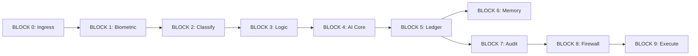

# REVENANT ATIS (v26.5 SOVEREIGN)
## Welcome to the "Iron Bank"

**Classification:** BANK-GRADE CONFIDENTIAL  
**Jurisdiction:** Republic of Uzbekistan (CBU Compliance)  
**Current Era:** v26 "Interbank Brain"  

---

## 1. MANIFESTO (Read This First)

**Revenant ATIS (Automated Transaction Intelligence System)** is not a chatbot. It is a sovereign-grade governance layer designed to sit between the Core Banking System (CBS) and customer communication channels.

### Our Core Philosophy
1.  **Zero Trust:** We do not trust the user. We do not trust the AI. We only trust cryptography.
2.  **Chain of Custody:** Every decision, every token, and every database write is secured by an immutable HMAC-SHA256 signature chain.
3.  **Sovereignty:** No data leaves the jurisdiction. The stack (n8n, Supabase, Redis) runs 100% on-premise in Uzbekistan.
4.  **"Hell-Safe":** Nothing executes unless it survives the 9-Block gauntlet.

> *"We are building the immune system for the sovereign AI era."*

---

## 2. THE SYSTEM ARCHITECTURE (The "Law")

Revenant processes every signal through a strict, linear pipeline. Signals only move forward; back-propagation is forbidden.

| Block | Role | The Mandate |
| :--- | :--- | :--- |
| **0. Ingress** | **Identity** | Generate W3C `traceparent`. Enforce Rate Limits. |
| **1. Biometric** | **Defense** | Spoof score > 0.3 = IMMEDIATE BLOCK. |
| **2. Classify** | **Router** | Hybrid Engine: Rule-based (Fast) → AI (Slow). |
| **3. Logic** | **Business** | Enforce SLAs. Calculate Unit Economics. |
| **4. AI Core** | **Brain** | Dynamic Prompt Construction. **Kill-Switch Active.** |
| **5. Ledger** | **Gatekeeper** | **Idempotency Gate.** Distributed Lock via Redis. |
| **6. Memory** | **Context** | Vector Search. Read-only for Agents. |
| **7. Audit** | **Witness** | **HMAC-SHA256 Signing.** PII Scrubbing. |
| **8. Firewall** | **Shield** | **$50k Hard Ceiling.** Currency Normalization. |
| **9. Execute** | **Hand** | Final Commit. Human-in-the-loop for Critical Actions. |

---

## 3. THE STRATEGIC ROADMAP (Where We Are Going)

We are currently at **v26**. Here is the future you are building:

### ✅ v24: EXECUTION ENGINE (Completed)
*   **Codename:** IRON HAND
*   **Goal:** Turn approved decisions into safe, irreversible actions.
*   **Key Tech:** Execution Contracts, Tool Sandbox.

### ✅ v25: AUTONOMOUS CONTROL PLANE (Completed)
*   **Codename:** SELF-GOVERNANCE
*   **Goal:** AI that monitors itself.
*   **Key Tech:** Internal watchdog, drift detection.

### 🚀 v26: INTERBANK BRAIN (Current Production)
*   **Codename:** FEDERATED TRUST
*   **Goal:** Allow multiple banks to collaborate on fraud detection without sharing raw data.
*   **Key Tech:** Federated Signal Exchange, Trust Registry.

### 🔮 v27: SOVEREIGN PROTOCOL (Next)
*   **Codename:** AI TREATIES
*   **Goal:** Cross-border AI cooperation via legally binding digital treaties.
*   **Key Tech:** Treaty Compiler, Jurisdiction Locks.

### 🔮 v28: BLACKBOX PROTOCOL (Future)
*   **Codename:** CRISIS MODE
*   **Goal:** Constitutional emergency law for AI.
*   **Key Tech:** Kill-Switch Treaties, Cryptographic Shutdown.

---

## 4. ONBOARDING & SETUP

### Developer Prerequisites
*   **Docker:** Essential for the containerized stack.
*   **JavaScript:** Strict ES6+ for Code Nodes.
*   **SQL:** PostgreSQL (Supabase flavor) for schema migrations.
*   **Discipline:** You will not merge code that breaks the signature chain.

---

## 5. DEVELOPER STANDARDS (The "Constitution")

### 1. Naming Convention is Non-Negotiable
We enforce strict naming to ensure auditability.
`[BLOCK_ID]: [Function] - [Version]`
*   ✅ `BLOCK 7.6: Forensic Signer - v26.0`
*   ❌ `Signer Node`, `Process Payment`

### 2. The "No-Code" Code
While n8n is a low-code tool, Revenant uses **strictly typed JavaScript code nodes** for all business logic.
*   **Prohibited:** Complex logic inside "Set" nodes or Expressions.
*   **Mandatory:** JSDoc headers in all Code nodes.
*   **Mandatory:** Input validation at the start of every Function.

### 3. Security First
*   **Secrets:** Never hardcode. Use `$vars` or `process.env`.
*   **Logs:** PII must be scrubbed BEFORE logging.
*   **Errors:** Every error must preserve the `trace_id`.

---

## 6. SOURCE OF TRUTH

*   **System Constitution:** The supreme architectural law.
*   **Roadmap:** The vision of the future.
*   **Production Handbook:** Operational runbooks.

*Welcome to the team. Trust, verifying itself.*
